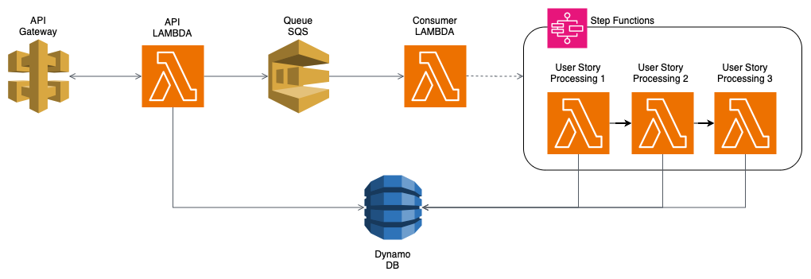

# Bugster Challenge

## How to run
```bash
# With docker:
touch bugster.db
docker-compose -f docker-compose.dev.yml up -d

# -------------------------------
# or
# Using python locally:
docker run -d -p 9324:9324 -p 9325:9325 softwaremill/elasticmq-native # the queue 
python3 -m venv venv
source venv/bin/activate
pip install -r requeriments.txt
# you need a terminal for the api and other for the consumer
python -m api.main
# in another terminal
python -m consmer.main sqs
```

## Documentation

### Complete API Documentation:
`http://localhost:3100/docs`

### Summary:
#### `[POST] api/v1/events`

I created some examples. Use the `events_login.json` or `events_search.json` in the body.

This endpint will save the events in the database, and enqueue the journey_ids for the user stories processing.

#### `[GET] api/v1/stories`

Get all user stories generated previously. You can filter by `session_id` with `?session_id=<session_id>`

#### `[GET] api/v1/tests`

Generate and return the tests. You can filter by `user_story_id` with `?user_story_id=<user_story_id>`

## Design

The project has 3 sections:
- `/api`

    Contains the controllers and schema validations. I used the MVC pattern and added a special layer called `services` to manage the business logic and interact with the ORM. This extra layer is also used in the consumer. FastAPI with pydantic for type validations.

- `/consumer`

    When the API receives events they are saved in the database and the journey_ids are enqueued in a AWS SQS. The consumer receives the messages from the AWS SQS and this is where the user stories processing takes off. I decided to implement a queue because the `api/v1/events` endpoint shouldn't take a lot of time to respond, so the queue allows us to do a better processing of the stories that could take some time without affecting the API, like interacting with an LLM or applying machine learning, classifying and identifying common patterns, etc.

- `/libs`

    Contains the `services` and `models`. It is used by both API and consumer.
    The services is where all the magic happens.  
    Also contains the database configurations, I chose a SQLite database for simplicity, but I think a NoSQL db would be better for faster access to the data, that is what we need. In the diagram design below I used a AWS Dynamo DB.


### How the user stories are generated

This is the key to get the best tests, so we need to identify correctly the actions we will need to replicate in the tests.  
See the funciton `generate_user_story` in `libs/services/user_stories.py` to see more details aboout how I did it.  
LLMs, ML, or other alghoritms should be used to improve the accuracy of the actions and final state (last one to use it in the assertsions), and to find common patterns. I used a `cosine_similarity` (from sklearn library) to find common patterns with existing stories (`identify_common_patterns` in `libs/services/user_stories`), for simplicity I hardcoded some common patterns (login and search) and if the alghoritm finds at least a 60% of similarity it adds the tags to the user story and finnaly saves it in the database. Maybe here is where we can avoid to save an user story if there are others similar, but I didn't implement that.

### How the tests are generated

The accuracy of the tests depends on the accuracy of the user stories, depending on the actions and attributes identified the `_convert_user_story_to_test` in `libs/services/tests_generator` generate the python function that uses playwright to execute the actions and get the assertions.  
The endpoint `api/v1/tests` will generate the tests and return the actions, assertions and test code, but it doesn't save it. So the user could review and edit the tests to finally save it.

### How to go to production

For the API we can use a AWS lambda function with an API Gateway. The `Dockerfile.api` file contains an image ready to deploy to a lambda function.  
The queue should be an AWS SQS and it could be configured to send the messages to the consumer that is also deployed in AWS as a lambda function (`Dockerfile.consumer`).  
In this repo the consumer has the complete user story processing, but if more complex steps were necessary AWS Step FUnctions could be used, like in the image below.


